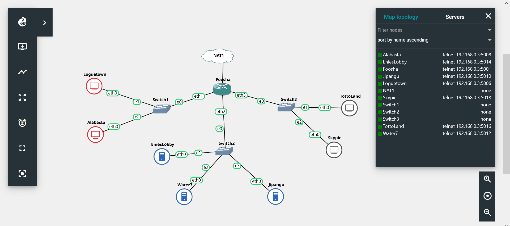
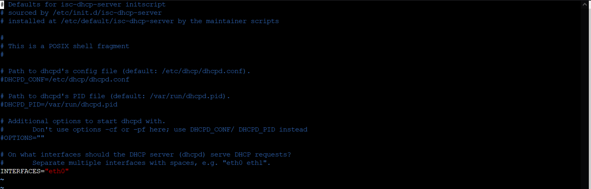
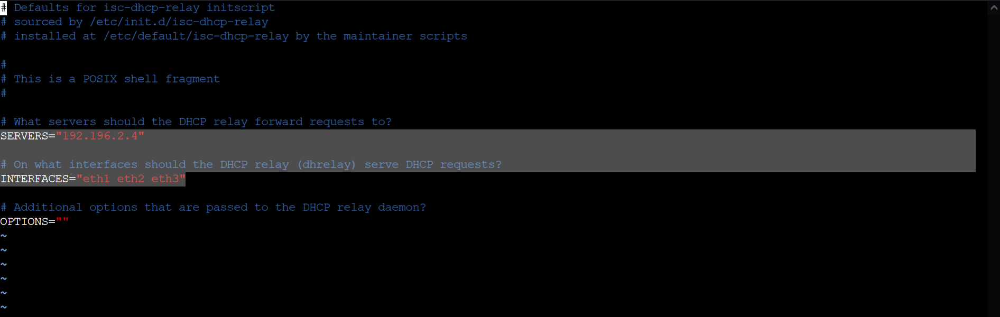
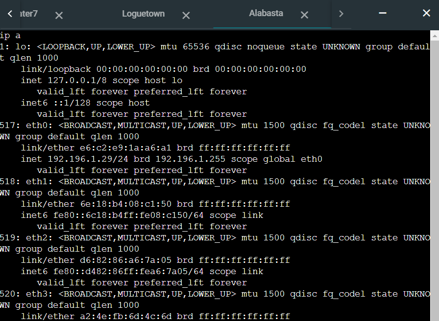
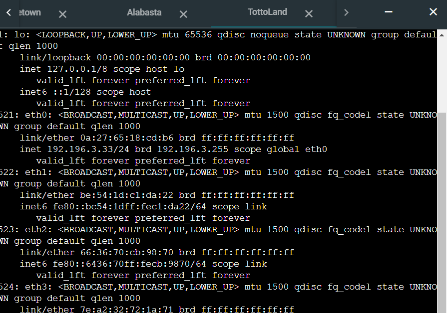
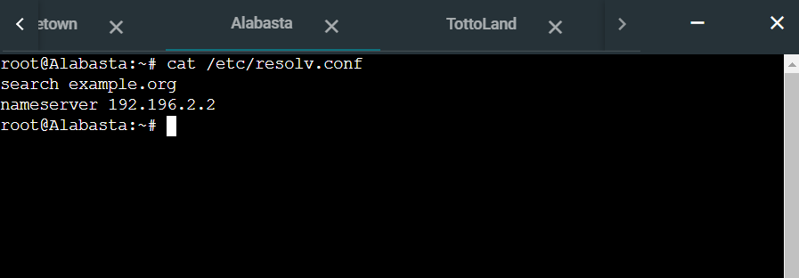
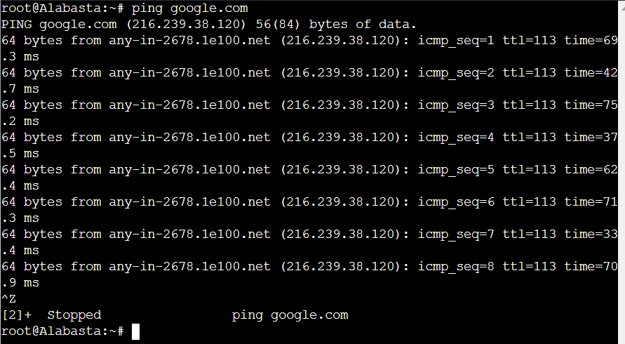
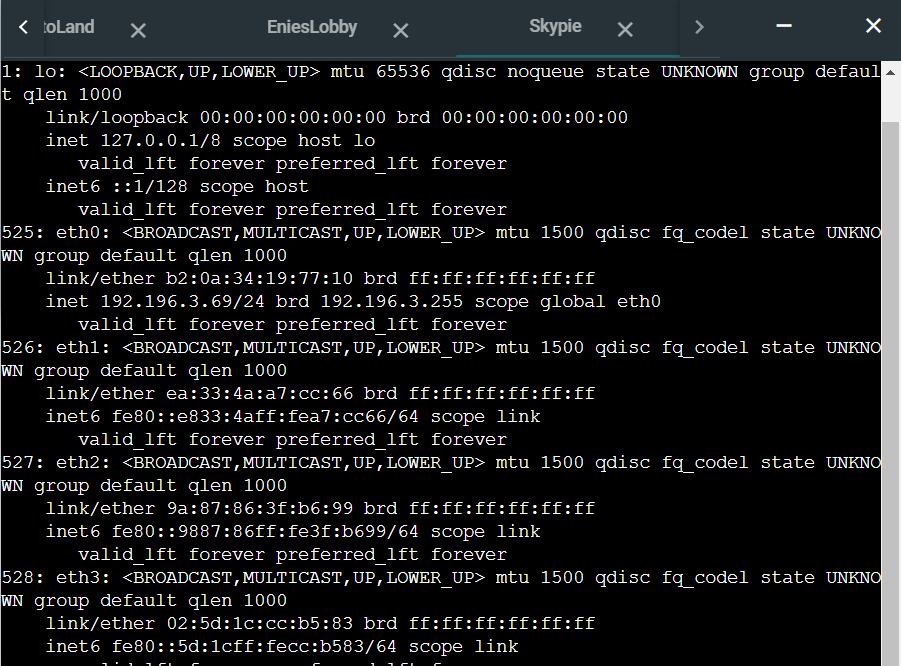

# Jarkom-Modul-3-D09-2021

Nama Anggota | NRP
------------------- | --------------		
Dias Tri Kurniasari | 05111940000035
Nazhwa Ameera H | 05111940000133
Nur Moh. Ihsanuddien | 05111940000142

## Pengaturan Awal 

### Pengaturan Topologi


### Edit Konfigurasi Network

#### Foosha (DHCP Relay)
``` 
    auto eth0
    iface eth0 inet dhcp

    auto eth1
    iface eth1 inet static
        address 192.196.1.1
        netmask 255.255.255.0

    auto eth2
    iface eth2 inet static
        address 192.196.2.1
        netmask 255.255.255.0

    auto eth3
    iface eth3 inet static
        address 192.196.3.1
        netmask 255.255.255.0  
```

#### EniesLobby (DNS Server)
```
    auto eth0
    iface eth0 inet static
        address 192.196.2.2
        netmask 255.255.255.0
        gateway 192.196.2.1
```

#### Water7 (Proxy Server)
```
   auto eth0
    iface eth0 inet static
        address 192.196.2.3
        netmask 255.255.255.0
        gateway 192.196.2.1 
```

#### Jipangu (DHCP Server)
```
    auto eth0
    iface eth0 inet static
        address 192.196.2.4
        netmask 255.255.255.0
        gateway 192.196.2.1  
```

#### Loguetown (Client)
```
    auto eth0
    iface eth0 inet static
        address 192.196.1.2
        netmask 255.255.255.0
        gateway 192.196.1.1   
```

#### Alabasta (Client)
```
    auto eth0
    iface eth0 inet static
        address 192.196.1.3
        netmask 255.255.255.0
        gateway 192.196.1.1
```

#### TottoLand (Client)
```
    auto eth0
    iface eth0 inet static
        address 192.196.3.2
        netmask 255.255.255.0
        gateway 192.196.3.1
```

#### Skypie (Client)
```
    auto eth0
    iface eth0 inet static
        address 192.196.3.3
        netmask 255.255.255.0
        gateway 192.196.3.1
```

## No 1
Luffy bersama Zoro berencana membuat peta tersebut dengan kriteria EniesLobby sebagai DNS Server, Jipangu sebagai DHCP Server, Water7 sebagai Proxy Server

Pertama, pada router `Foosha` jalankan perintah `iptables -t nat -A POSTROUTING -o eth0 -j MASQUERADE -s 192.196.0.0/16` agar dapat terhubung dengan jaringan luar. Kemudian, pada EniesLobby, Water7, dan Jipanggu jalankan perintah `echo "nameserver 192.196..." > /etc/resolv.conf` yang berguna untuk setting IP DNS agar terhubung dengan jaringan luar.

Setelah itu, melakukan instalasi:
- EnniesLobby
```
    apt-get update
    apt-get install bind9
```

- Jipangu
```
    apt-get update
    apt-get install isc-dhcp-server
```

- Water7
```
apt-get update
apt-get install squid
```

Kemudian, pada `Jipangu` edit file `/etc/default/isc-dhcp-server` dengan menambahkan `eth0` pada `INTERFACES`




## No 2
Foosha sebagai DHCP Relay

Pertama lakukan instalasi DHCP Relay dengan penjalankan perintah :
```
apt-get update
apt-get install isc-dhcp-relay
```

Setelah itu, edit file `/etc/default/isc-dhcp-relay` dengan menambahkan IP `Jipangu` pada `SERVER` dan `eth1 eth2 eth3` pada `INTERFACES`.




## No 3
Client yang melalui Switch1 mendapatkan range IP dari [prefix IP].1.20 - [prefix IP].1.99 dan [prefix IP].1.150 - [prefix IP].1.169

Pada `Jipangu` tambahkan isi file `/etc/dhcp/dhcpd.conf` dengan perintah:
```
    subnet 192.196.1.0 netmask 255.255.255.0 {
        range 192.196.1.20 192.196.1.99;
        range 192.196.1.150 192.196.1.169;
        option routers 192.196.1.1;
        option broadcast-address 192.196.1.255;
        option domain-name-servers 192.196.2.2;
        default-lease-time 360;
        max-lease-time 7200;
    }
```

Kemudian lakukan perintah `service isc-dhcp-server restart` dan lakukan testing dengan menyalakan `Alabasta` atau `Loguetown` kemudian lakukan perintah `ip a`




## No 4
Client yang melalui Switch3 mendapatkan range IP dari [prefix IP].3.30 - [prefix IP].3.50

Pada `Jipangu` tambahkan isi file `/etc/dhcp/dhcpd.conf` dengan perintah:
```
    subnet 192.196.3.0 netmask 255.255.255.0 {
        range 192.196.3.30 192.196.3.50;
        option routers 192.196.3.1;
        option broadcast-address 192.196.3.255;
        option domain-name-servers 192.196.2.2;
        default-lease-time 720;
        max-lease-time 7200;
```

Kemudian lakukan perintah `service isc-dhcp-server restart` dan lakukan testing dengan menyalakan `Skypie` atau `Tottoland` kemudian lakukan perintah `ip a`




## No 5
Client mendapatkan DNS dari EniesLobby dan client dapat terhubung dengan internet melalui DNS tersebut.

Pertama, pada `EniesLobby` edit file `/etc/bind/named.conf.options` sebagai berikut :
```
forwarders {
        "IP nameserver dari Foosha";
    };

    allow-query{any;};
```
Selain itu pada file yang sama lakukan command
```
    // dnssec-validation auto;
```
Kemudian lakukan `service bind9 restart`.

Pada `Jipangu` edit file `/etc/dhcp/dhcpd.conf` dengan menambahkan IP EniesLobby pada `option domain-name-servers` pada `subnet 192.196.1.0` dan `subnet 192.196.3.0`. Untuk testing lakukan `ping google.com` pada Client.





## No 6
Lama waktu DHCP server meminjamkan alamat IP kepada Client yang melalui Switch1 selama 6 menit sedangkan pada client yang melalui Switch3 selama 12 menit. Dengan waktu maksimal yang dialokasikan untuk peminjaman alamat IP selama 120 menit.

Pada `Jipangu` edit file `/etc/dhcp/dhcpd.conf` untuk Switch1 atau `subnet 192.196.1.0` tambahkan :
```
    default-lease-time 360;
    max-lease-time 7200;
```

dan untuk Switch3 atau `subnet 192.196.3.0` tambahkan :
```
    default-lease-time 720;
    max-lease-time 7200;
```


## No 7
Luffy dan Zoro berencana menjadikan Skypie sebagai server untuk jual beli kapal yang dimilikinya dengan alamat IP yang tetap dengan IP [prefix IP].3.69

Pertama pada `Jipangu` edit file `/etc/dhcp/dhcpd.conf` tambahkan :
```
`host Skypie {
    hardware ethernet b2:0a:34:19:77:10;
    fixed-address 192.196.3.69;
}
```
Kemudian jalankan perintah `service isc-dhcp-server restart`

Setelah itu, pada Skypie edit file `/etc/network/interfaces` dengan menambahkan `hwaddress ether b2:0a:34:19:77:10`. 

Kemudian restart pada client dan lakukan perintah `ip a`.




## No 8
Pada Loguetown, proxy harus bisa diakses dengan nama jualbelikapal.yyy.com dengan port yang digunakan adalah 5000

## No 9
Agar transaksi jual beli lebih aman dan pengguna website ada dua orang, proxy dipasang autentikasi user proxy dengan enkripsi MD5  dengan dua username, yaitu luffybelikapalyyy dengan password luffy_yyy dan zorobelikapalyyy dengan password zoro_yyy

## No 10
Transaksi jual beli tidak dilakukan setiap hari, oleh karena itu akses internet dibatasi hanya dapat diakses setiap hari Senin-Kamis pukul 07.00-11.00 dan setiap hari Selasa-Jum’at pukul 17.00-03.00 keesokan harinya (sampai Sabtu pukul 03.00)

## No 11
Web server super.franky.yyy.com berada pada node Skypie

1. Membuka `EniesLobby` ,kemudian melakukan konfigurasi seperti berikut


Kemudian membuat dan konfigurasi pada `/etc/bind/kaizoku/super.franky.d09.com`


Melakukan `service bind9 restart`

2. Membuka `Skypie` dan menginstall seperti berikut


Membuat `mkdir /var/www/super.franky.d09.com`
Mendonwload dan Unzip `super.franky` dan meindahkan ke `/var/www/super.franky.d09.com`
Melakukan copy `cp /etc/bind/db.local /etc/bind/kaizoku/super.franky.d09.com.conf` dan mengisi dengan konfigurasi berikut


Melakukan `a2ensite super.franky.d09.com` kemudian `service apache2 restart`

3. Membuka Water7 dan pada file `/etc/squid/squid.conf` menambahkan konfigurasi:


menjadi 


Kemudian melakukan `Service squid restart` 

### Testing

Melakukan `lynx google.com` pada Client `LogueTown`

Dan setelah melakukan login akan membuka halaman super.franky.d09.com


## No 12
Karena Luffy orangnya sangat teliti untuk mencari harta karun, ketika ia berhasil mendapatkan gambar, ia mendapatkan gambar dan melihatnya dengan kecepatan 10 kbps


Dimana untuk mengatur bandwitch dimana agar kecepatan 10 kbps diperoleh konversi ke 1250 byte 
Pada `Water7` dilakukan membuat dan melakukan konfigurasi pada `/etc/squid/acl-bandwidth.conf` dengan menambahkan
```
acl download url_regex -i .jpg$ .png$
auth_param basic program /usr/lib/squid/basic_ncsa_auth /etc/squid/passwd

acl luffy proxy_auth luffybelikapald09
acl zoro proxy_auth zorobelikapald09

delay_pools 

delay_class 1 1
delay_parameters 1 1250/1250
delay_access 1 allow luffy
delay_access 1 deny zoro
delay_access 1 allow download
delay_access 1 deny all
```

Kemudian memasukkan file `/etc/squid/acl-bandwidth.conf ` tersebut ke dalam `/etc/squid/squid.conf`
```
echo '
include /etc/squid/acl/bandwidth.conf
' >> /etc/squid/squid.conf
```

### Testing


## No 13
Sedangkan, Zoro yang sangat bersemangat untuk mencari harta karun, sehingga kecepatan kapal Zoro tidak dibatasi ketika sudah mendapatkan harta yang diinginkannya

Seperti pada `Soal 12` , melakukan penambahan pada file `/etc/squid/acl-bandwidth.conf ` dengan konfigurasi
```
delay_class 2 1
delay_parameters 2 none
delay_access 2 allow zoro
delay_access 2 deny luffy
delay_access 2 deny all 
```
Dimana akan didapatkan akses Zoro tidak mendapat limit bandwitch sehingga ketika melakukan donwload akan langsung berhasil 
### Testing


## Error dan Kendala
